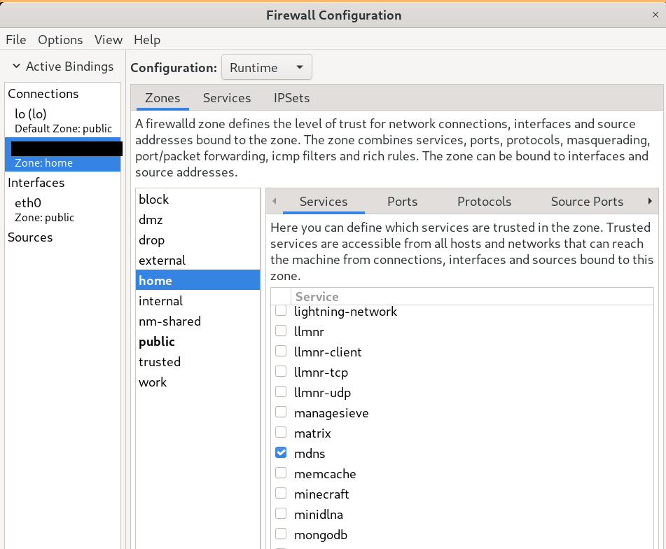

I really enjoyed pop_os! on my Z13, but I was experiencing some issues when
docking the laptop with multiple monitors (frequent crashes, hang-ups). I was
also just curious about using an Arch based distro and an updated version of
Gnome, so I installed Endeavour OS.

I've had to make enough adjustments that I think another post is warranted.

## Sleep Issues

The issue where the WiFi speeds dip dramatically after sleep is back. My fix
this time around is very similar to the last one I posted.

I copied this script:

```bash
#!/bin/sh

PATH=/sbin:/usr/sbin:/bin:/usr/bin

case "$1" in
	#code execution BEFORE sleeping/hibernating/suspending
	pre)
		echo "Turning off Wi-Fi"
		rfkill block wlan
	;;
	#code execution AFTER resuming
	post)
		echo "Turning Wi-Fi back on"
		rfkill unblock wlan
	;;
esac

exit 0
```

to `/usr/lib/systemd/system-sleep/`[^3]. You can name it whatever you like, it just has
to be executable. I figured deleting the module like I posted
before was overkill since the problem was also solved by just toggling the Wi-Fi
on and off.

[^3]: The [Arch
Wiki](https://wiki.archlinux.org/title/Power_management#Hooks_in_/usr/lib/systemd/system-sleep)
says to use `/usr/lib/systemd/system-sleep/`, but this
[AskUbuntu](https://askubuntu.com/questions/1313479/correct-way-to-execute-a-script-on-resume-from-suspend)
post used `/lib/systemd/system-sleep`. Since I'm using Arch I'm going with the
Arch wiki, but it seems like either would work (and I definitely used the
AskUbuntu way on pop_os!).

## Fingerprint Sensor

As before I started with installing fprintd (`yay -S fprintd`). Just doing this
enabled Gnome's fingerprint support and the lock screen worked well.

The pam files were different on Arch so I had to do a little bit more digging to
get the fingerprint scanner working well for authing other requests. There
wasn't a magic command to run that just figured it out for me (which was awesome
on pop_os! and I wish there had been one in this case), but the Arch wiki[^1]
was extremely helpful as always.

For my first attempt to get fingerprint auth working with sudo, my `/etc/pam.d/sudo`
looked like this:

```bash
#%PAM-1.0
auth	  	sufficient 	pam_fprintd.so # addded line
auth		include		system-auth
account		include		system-auth
session		include		system-auth
```

This didn't work super well with `yay`, as I'd press
<kbd>Ctrl</kbd>+<kbd>C</kbd> to get past the fingerprint auth (when using the
laptop docked, for example), and the whole program would just exit. This
behavior would also trigger pam_faillock, locking me out of authing any sudo
commands for 15 minutes each time. Super annoying.

Reading just a little further down on the page, I removed the above edit and
instead edited `/etc/pam.d/system-auth` like so:

```bash
#%PAM-1.0

# deny=10 because the default of 3 is constantly getting me locked out
auth       required                    pam_faillock.so      preauth deny=10
# Optionally use requisite above if you do not want to prompt for the password
# on locked accounts.
-auth      [success=3 default=ignore]  pam_systemd_home.so  try_first_pass nullok likeauth
auth       [success=2 default=ignore]  pam_unix.so          try_first_pass nullok likeauth
auth       [success=1 default=bad]     pam_fprintd.so
auth       [default=die]               pam_faillock.so      authfail
auth       optional                    pam_permit.so
auth       required                    pam_env.so
auth       required                    pam_faillock.so      authsucc
# If you drop the above call to pam_faillock.so the lock will be done also
# on non-consecutive authentication failures.

-account   [success=1 default=ignore]  pam_systemd_home.so
account    required                    pam_unix.so
account    optional                    pam_permit.so
account    required                    pam_time.so

-password  [success=1 default=ignore]  pam_systemd_home.so
password   required                    pam_unix.so          try_first_pass nullok shadow
password   optional                    pam_permit.so

-session   optional                    pam_systemd_home.so
session    required                    pam_limits.so
session    required                    pam_unix.so
session    optional                    pam_permit.so
```

As you can see, rather than try to auth with the fingerprint first, we first try
to auth regularly and allow the stack to continue normally if an empty password
is supplied. This means that whenever I want to use my fingerprint, I can just press
<kbd>Enter</kbd> first. I can live with that.

There is one caveat to note: `system-auth` is included in a ton of other places,
so this may not be the most secure option, but I think I'm fine with allowing
most situations to be authorized using my fingerprint when possible.

[^1]: https://wiki.archlinux.org/title/Fprint

### Debugging Tip

One factor that confused my debugging process was the fact that my keyring
password was set to the password I used to encrypt my disk. I'm not sure if I
did that or the installer did, but I initially thought that this behavior was
another symptom of triggering the lockout. I ended up installing seahorse (`yay
-S seahorse`) to change the password on my keyring to what I expected it to be
(the same as my login password set via `passwd`). This works until I restart,
and then it's set back to my LUKS password. Not sure how to change this but I don't
mind it I guess.

## Misc

### auto-cpufreq

This post[^2] mentioned using auto-cpufreq, but it didn't work for me. For some
reason when I had it enabled the trackpoint would register random right clicks
when the laptop was docked. I'm just using Gnome power profiles now and battery
life is great on Power Saver (e.g. as I write this at 86% I have an estimated 8 hours
left with the keyboard backlight on low, 27 tabs open in brave and 4 tabs open
in Kitty).

### mDNS

To get mDNS working (the feature that enables you to go to a host-name.local
service you may be running on your LAN), I had to:

1. Open the firewall application
   and assign my network to the "home" zone, where mDNS is enabled by default. I
   figured this out while browsing [this Endeavour OS wiki
   page](https://discovery.endeavouros.com/applications/firewalld/).

   Example:

   

2. Enable a daemon that provides mDNS. I used Avahi, so I followed the
   instructions [here](https://wiki.archlinux.org/title/Avahi). You should also
   be able to use resolved following the instructions
   [here](https://wiki.archlinux.org/title/Systemd-resolved#mDNS) (it just
   seemed like more work).

[^2]: One of the most helpful posts I looked at:
[https://blog.15cm.net/2022/08/21/my_arch_linux_setup_on_thinkpad_z13_gen_1/](https://blog.15cm.net/2022/08/21/my_arch_linux_setup_on_thinkpad_z13_gen_1/)

### Brave & Wayland

If you're using `brave-bin` from the AUR, then you can add any Brave
flags[^brave_flags] you
want to use permanently to `$XDG_CONFIG_HOME/brave-flags.conf`. Here's what I
use to make Brave use Wayland and allow the two-finger swipe gesture to go back
and forth in history.

```bash
--gtk-version=4
--ozone-platform-hint=auto
--enable-features=TouchpadOverscrollHistoryNavigation
--ozone-platform=wayland
```

The ozone-platform setting makes the title bar weirdly smaller, but that's the
only downside I've noticed.

[^brave_flags]: The Chromium page of the Arch wiki was extremely helpful here:
https://wiki.archlinux.org/title/Chromium
