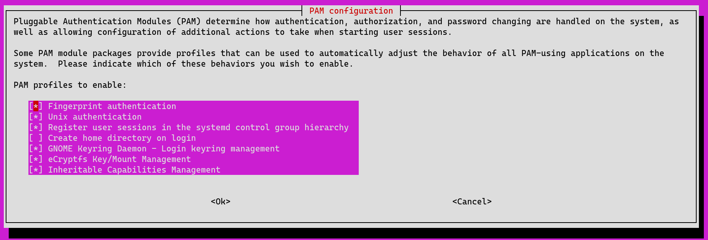

This is basically just a walk-through of my [install
script](https://github.com/Anthony-Fiddes/dotfiles/blob/main/hw_specific/lenovo_z13/install.fish)
for the Lenovo Z13 Thinkpad. I'm using pop_os!, but the commands/ideas should
work for any Debian based distro.

I'll periodically come back to update this page with any new findings specific
to running Linux on my Z13.

## Basics

On pop_os, the "Firmware" app automatically had Lenovo Z13 updates ready for me
to install.

Of course, doing a `sudo apt update && sudo apt upgrade` is always a good idea
before doing anything else with apt on a clean install.

Then you'll want to install the Z13 package included on Lenovo's Ubuntu
image[^1]:

[^1]:
    Learned this while reading Martin's great review
    [here](https://wimpysworld.com/posts/why-i-chose-the-thinkpad-z13-as-my-linux-laptop/)

```bash
sudo apt install oem-sutton.newell-abe-meta
```

If you want to be able to adjust the force touchpad settings (you probably do)
download Lenovo's janky-but-functional tool [here](https://pcsupport.lenovo.com/us/en/products/laptops-and-netbooks/thinkpad-z-series-laptops/thinkpad-z13-type-21d2-21d3/downloads/ds561548-elan-haptic-pad-settings-tool-for-linux-thinkpad-z13-gen-1-z16-gen-1).

## Sleep Issues

> 2023-09-17 Update:
>
> I didn't change anything, but I've noticed that wake from
> sleep times have substantially improved (from a noticeable couple of seconds to
> near instant upon opening the lid).
>
> I experimented further by removing the modprobe line from the following sleep
> script and I noticed that it's no longer needed for my Wi-Fi to be performant
> after sleep. I assume this came for free with some kernel/system updates, but
> I'm leaving the section below in case it's still helpful on some environments.

I had the same problems that others online experienced when it came to the
Wi-Fi adapter being slow after waking up from sleep.

I tried a bunch of other methods (toggling the Wi-Fi off/on upon waking from
sleep, changing the power-saving settings in NetworkManager, etc.) but this is
what ultimately ended up working for me:

```bash
#!/bin/sh
# save to /lib/systemd/system-sleep/

PATH=/sbin:/usr/sbin:/bin:/usr/bin

case "$1" in
	#code execution BEFORE sleeping/hibernating/suspending
	pre)
		xinput set-prop "ELAN06A0:00 04F3:3231 Touchpad" "Device Enabled" 0
	;;
	#code execution AFTER resuming
	post)
		# Fix wifi speeds by reloading module
		sudo modprobe -r ath11k_pci && sudo modprobe ath11k_pci
		# Toggle touchpad to make two finger right clicks more reliable
		xinput set-prop "ELAN06A0:00 04F3:3231 Touchpad" "Device Enabled" 1
	;;
esac

exit 0
```

I got the idea from [this
post](https://blog.15cm.net/2022/08/21/my_arch_linux_setup_on_thinkpad_z13_gen_1/#touchpad-bad)
that mentioned deleting and reinserting the `ath11k_pci` kernel module using
`systemd-suspend-modules` on Arch. The above works fine for me on pop_os.

As you can see, I also found that restarting the touchpad made it a little bit
more reliable when it came to palm rejection and tap-to-click (although this
could be purely placebo).

## Fingerprint Sensor

```bash
sudo apt install fprintd libpam-fprintd
sudo pam-auth-update
```

You'll see this screen:



You want to enable fingerprint authentication. After doing that I was able to
set up my fingerprints in the settings app and use it to auth sudo and
login.

The only problem I've noticed is that if I use my fingerprint for my first
login after powering on my device, I have to type in my password anyways when I
start my browser to login to my keyring.

One note: the fingerprint sensor on the Z13 is not as fast as the one you might
have on your phone. You'll want to hold your finger to the sensor a bit longer
in order for it to successfully read your fingerprint consistently.

## Helpful Resources

### Audio Problems

Sometimes I found that no sound would come from my Z13's speakers. The f1/2/3
audio buttons also wouldn't work and the system behaved as if it had no
speakers connected. [This](https://support.system76.com/articles/audio/)
article by System76 was pretty helpful for troubleshooting. What I did to
improve my issue was:

- I reinstalled/restarted pipewire per the instructions in the article above.
- I disabled hibernation/fast startup/secure boot on my Windows install and
  bios.

I'm not sure which solved the problem, but it's not happening anymore so I'm
happy.
